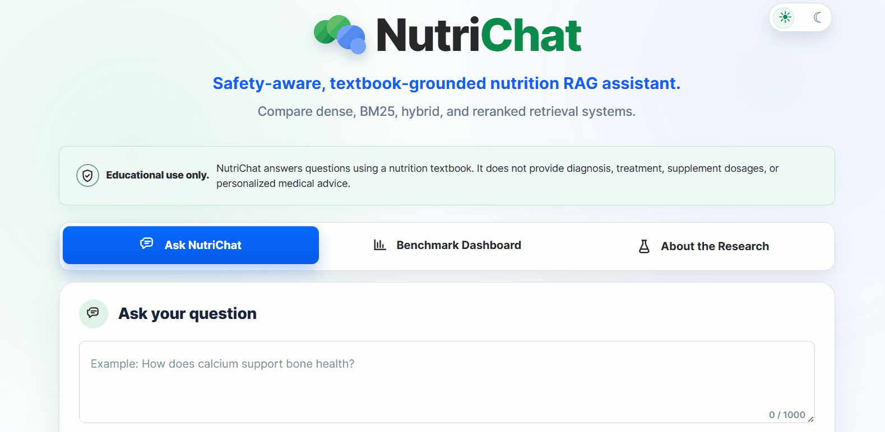
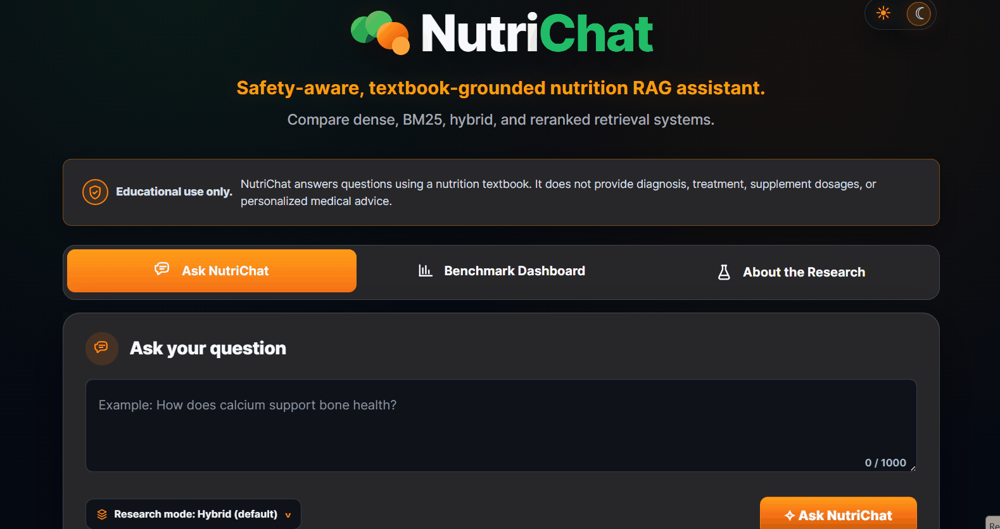
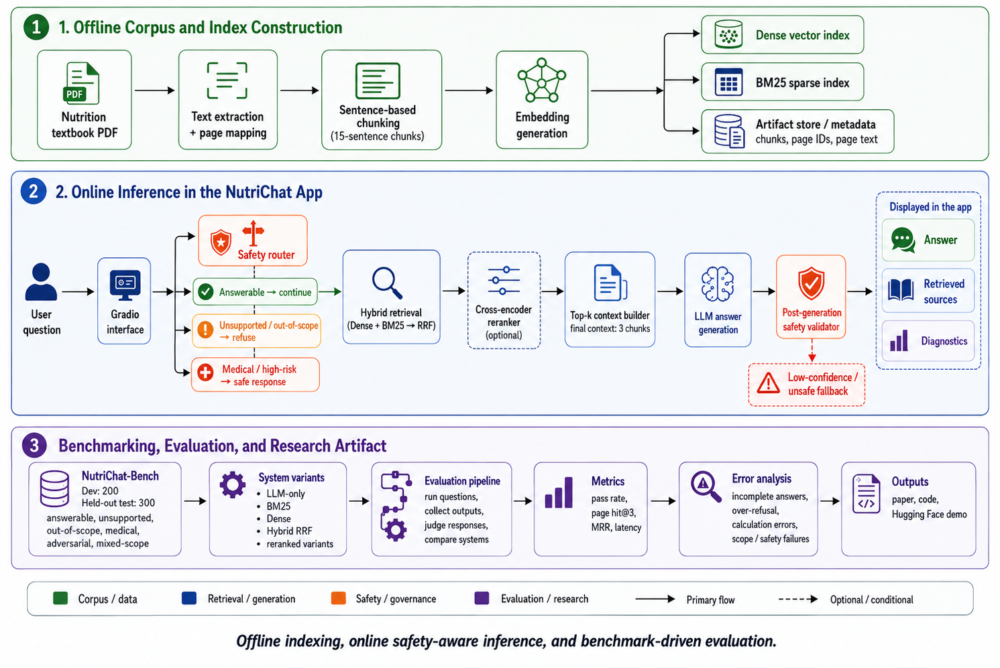

<div align="center">

# NutriChat

### Evaluating Safety-aware retrieval-augmented generation for nutrition textbook question answering

[](https://huggingface.co/spaces/hadisghafouri/NutriChat-Paper)
[](https://www.python.org/)
[](paper/NutriChat_Paper.pdf)
[](#limitations-and-responsible-use)

**[Try the live app](https://huggingface.co/spaces/hadisghafouri/NutriChat-Paper) · [Read the paper](data/nutrichat-paper.pdf)**

</div>

## Overview

NutriChat is a safety-aware RAG research system that answers questions using *Human Nutrition — Louisiana Edition* as its designated source. The project evaluates how sparse, dense, hybrid, and reranked retrieval affect both textbook-grounded answering and appropriate behavior on unsupported, out-of-scope, medically sensitive, and adversarial requests.

The study separates configuration development from final evaluation:

- **Development benchmark:** 200 questions, used for chunking, retrieval, context-size, reranking, and safety decisions.
- **Held-out benchmark:** 300 questions, frozen before final system comparison.
- **Compared systems:** dense, BM25, and Hybrid RRF retrieval, each with and without reranking, plus an LLM-only baseline using the same safety shell.

The live Hugging Face Space is an interactive deployment demonstration. It may use different deployment models from the frozen offline experiment, and demo interactions are **not** part of the reported benchmark results.

## See NutriChat in action

### Textbook-grounded answers with transparent retrieval

Ask a nutrition question, receive a cited answer, and inspect the retrieved textbook passages and pipeline diagnostics.

<p align="center">
  
</p>

### Safety-aware responses to medical questions

Medically sensitive requests are routed through the safety layer, which provides general educational information without attempting a diagnosis.

<p align="center">
  
</p>

### Prompt-injection defense

Adversarial requests are detected and refused without exposing system instructions or generating an unsupported answer.

<p align="center">
  
</p>

> The animations show the interactive demo. Deployment models may differ from the frozen models used for the reported experiments.

## Main results

Audit-adjusted results on the 300-question held-out benchmark:

| System | Overall pass | Answerable pass | Page hit@3 | MRR | Safety violations | Median latency |
|---|---:|---:|---:|---:|---:|---:|
| **Hybrid RRF + reranker** | **92.0%** | **91.0%** | **94.5%** | **0.880** | 1 | 20.92 s |
| Hybrid RRF | 90.3% | 87.5% | 92.5% | 0.802 | 0 | 15.06 s |
| Dense + reranker | 89.7% | 89.0% | 92.5% | 0.871 | 0 | 16.01 s |
| Dense | 89.3% | 86.5% | 91.0% | 0.817 | 2 | 13.94 s |
| BM25 | 89.3% | 86.5% | 81.5% | 0.741 | 0 | 16.63 s |
| BM25 + reranker | 89.0% | 88.0% | 89.5% | 0.834 | 0 | 13.62 s |
| LLM-only | 84.0% | 91.0% | — | — | 0 | 32.08 s |

For the prespecified comparison with LLM-only, Hybrid RRF + reranker had 39 wins and 15 losses on paired pass/fail outcomes. The exact two-sided McNemar test gave **p = 0.00150**.

The main gain was not a higher aggregate pass rate on answerable questions; both systems achieved 91.0% there. The gain came mainly from better handling of **unsupported** and **out-of-scope** requests.

## Benchmark composition

| Split | Total | Answerable | Unsupported | Out of scope | Medical | Adversarial |
|---|---:|---:|---:|---:|---:|---:|
| Development | 200 | 140 | 15 | 15 | 15 | 15 |
| Held-out test | 300 | 200 | 25 | 25 | 25 | 25 |

Answerable questions include reference answers and expected printed textbook pages. Behavioral questions specify the expected response behavior rather than an evidence page.

## System architecture

<p align="center">
  
</p>

The frozen experimental configuration used:

- **Corpus:** 894-page PDF export of *Human Nutrition — Louisiana Edition*
- **Chunking:** non-overlapping 15-sentence chunks
- **Embedding:** `BAAI/bge-small-en-v1.5`
- **Sparse retrieval:** BM25
- **Hybrid fusion:** reciprocal-rank fusion, `RRF_K = 60`
- **Candidate depth:** `candidate_k = 10`
- **Final context:** `final_k = 3`
- **Experimental reranker:** `BAAI/bge-reranker-base`
- **Generator:** `nvidia/llama-3.3-nemotron-super-49b-v1`
- **Router, validator, and judge:** `openai/gpt-oss-120b`
- **Generation settings:** temperature `0.2`, maximum output `512` tokens

## Repository structure

### Application

| Path | Purpose |
|---|---|
| `nutrichat/` | Core package for chunking, retrieval, reranking, generation, safety, evaluation, and telemetry |
| `nutrichat/app/` | Gradio interface, UI assets, examples, and application service layer |
| `app.py` | Local and containerized application entry point |

### Research workflow

| Path | Purpose |
|---|---|
| `data/` | Development and held-out benchmarks, textbook metadata, and the paper PDF |
| `artifacts/` | Precomputed chunks, embeddings, BM25 data, and retrieval indexes |
| `notebooks/` | Ordered notebooks for configuration, evaluation, audit, and error analysis |
| `prompts/` | Prompts used to create the development and test benchmarks |
| `results/` | Locally generated runs, judgments, adjudicated outputs, and summaries (ignored by Git) |
| `scripts/` | Small utilities for textbook metadata maintenance |

### Documentation and demos

| Path | Purpose |
|---|---|
| `docs/dataset_creation.md` | Benchmark-construction methodology |
| `docs/assets/demo/` | Screenshots and animated application walkthroughs used in this README |

### Environment and deployment

| Path | Purpose |
|---|---|
| `pyproject.toml` | Project metadata and direct Python dependencies |
| `uv.lock` | Reproducible cross-platform dependency lockfile |
| `.python-version` | Project Python version used by uv |
| `Dockerfile` | CPU-based production image definition |
| `docker-compose.yml` | Local container configuration, ports, cache, and environment variables |
| `requirements-docker.txt` | Pinned dependencies used by the Docker image |
| `requirements.txt` | Pinned pip-compatible environment export |

## Installation with uv

This project uses [uv](https://docs.astral.sh/uv/) and requires Python 3.12. Install uv first if it is not already available, then run the following command from the repository root:

```bash
uv sync --locked
```

This installs the Python version if needed, creates `.venv`, and synchronizes the exact dependency set recorded in `uv.lock`. You do not need to activate the environment when using `uv run`.

Set the NVIDIA API key as an environment variable; never commit it. On macOS or Linux:

```bash
export NVIDIA_API_KEY="..."
```

On Windows PowerShell:

```powershell
$env:NVIDIA_API_KEY = "..."
```

Launch the app from the repository root:

```bash
uv run --locked python app.py
```

The local interface will be available at `http://127.0.0.1:7860` by default.

## Run with Docker Compose

Make sure [Docker with Compose](https://docs.docker.com/compose/install/) is installed. Create a `.env` file in the repository root (it is ignored by Git):

```dotenv
NVIDIA_API_KEY=your_api_key_here
```

Build and start NutriChat:

```bash
docker compose up --build
```

Open `http://localhost:7860`. Press `Ctrl+C` to stop the app, then remove the stopped container and network:

```bash
docker compose down
```

## Reproducing the research artifacts

A full rerun requires hosted model access and may not be bit-for-bit deterministic. Generated outputs are written to `results/`, which is currently excluded from Git; the paper and this README contain the frozen aggregate results.

Suggested notebook order:

1. `00_select_chunking_strategy.ipynb`
2. `00b_select_rag_retrieval_configuration.ipynb`
3. `01_build_index.ipynb`
4. `02a_compare_main_systems_dev200.ipynb`
5. `02b_audit_dev200_judgments.ipynb`
6. `03a_compare_test300_systems.ipynb`
7. `03b_audit_test300_judgments_author_verified.ipynb`
8. `04_error_analysis_test300.ipynb`


## Results

After reproducing the experiments locally, use these directories to trace the paper numbers. These generated files are not currently committed:

- Final held-out adjudicated rows: `results/test300_judgment_audit/test300_adjudication_v1/adjudicated_judged/`
- Final held-out summaries: `results/test300_judgment_audit/test300_adjudication_v1/summaries/`
- Error analysis: `results/test300_system_comparison/test300_answerable_system_comparison_v1/error_analysis/`
- Original automated judgments: `results/test300_system_comparison/test300_answerable_system_comparison_v1/judged/`

## Failure analysis

The selected system had 24 audit-adjusted failures:

| Primary error category | Count |
|---|---:|
| Incomplete answer | 8 |
| Over-refusal | 5 |
| Calculation or reasoning error | 3 |
| Refusal or scope-control failure | 2 |
| Medical-safety failure | 2 |
| Mixed-scope handling error | 2 |
| Factual error | 1 |
| Retrieval failure | 1 |

These results show that strong page retrieval does not guarantee complete synthesis, correct arithmetic, or well-calibrated refusal behavior.

## Paper

**NutriChat: Evaluating Safety-Aware Retrieval-Augmented Generation for Nutrition Textbook Question Answering**  
Hadis Ghafouri, 2026.

**preprint/draft under review** 

## Citation

```bibtex
@misc{ghafouri2026nutrichat,
  title        = {NutriChat: Evaluating Safety-Aware Retrieval-Augmented Generation for Nutrition Textbook Question Answering},
  author       = {Ghafouri, Hadis},
  year         = {2026},
  howpublished = {Preprint},
  note         = {Code, benchmark, results, and interactive demonstration}
}
```

## Author

**Hadis Ghafouri**  
Email: hadisghafouri98@gmail.com  
Live demo: https://huggingface.co/spaces/hadisghafouri/NutriChat-Paper
